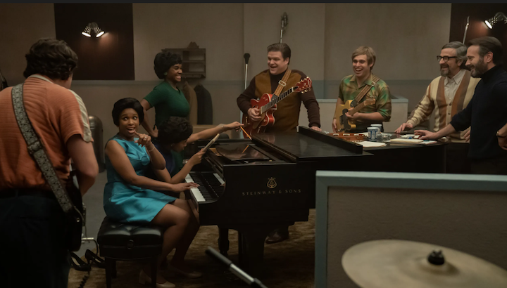

class: center, middle, inverse, my-one-page-font

# Introduction to Design Thinking

_J. Hathaway: Instructor_   
_Gavin South: TA_   
_Wyatt Ogden: TA_   

---

class: center, middle
# J. Hathaway

## Reformed statistician that loves [all things data science](https://byuidatascience.github.io/), [all things theology](https://www.mostmovedmover.com/), and being a husband and father.

---

class: center, middle, font40
# What makes great music?

???

Highlight how you felt watching the Respect movie on Aretha when their group begins hear each other and play music that moves.  Great music feeds off of great musicians that understand what moves people.

---

class: font40
# What makes a good musician?

_Can we attempt to describe what gives people skills in an area._
--

- What makes a great therapist?
--

- What makes a great teacher?
--

- What makes a great carpenter?
--

- What makes a great data scientist?

---

class: class: center, middle, font40
# What makes a great runner?

<iframe width="760" height="415" src="https://www.youtube.com/embed/nQWMLWoGEOw" title="YouTube video player" frameborder="0" allow="accelerometer; autoplay; clipboard-write; encrypted-media; gyroscope; picture-in-picture" allowfullscreen></iframe>

---

class: font40
# Learning Empathy, Persuasion, and Emotional Intelligence

- Building mindsets does not involve grades
- Becoming is more than taking a class
- We get the chance to develop the core employable skills of the future
--
   
> __Becoming something more always has Nathan Sorrell moments (Nike Commercial)__

---

class: center, middle, inverse, font40
# Getting to know you

---

class: font40
# Stand up if...

- You went to high school east of the Rockies.
--

- You have more than 5 siblings.
--

- You are married.
--

- You want to go to graduate school.
--

- Rexburg is where you want to raise your family.
--

---

class: center, middle, inverse, font40
# Lifestyles, Grades, 
# & Design Thinking

---

class: font40
# On Grades

> The central argument here is that by acting as if grading motivates learning, we put both student and faculty energies in the wrong places. Does grading represent learning? Maybe … but mostly, grading motivates getting grades.

[Diane Pike](http://onlinelibrary.wiley.com/doi/10.1111/j.1533-8525.2010.01195.x/abstract)

---

class: font30
# On Education

> Anthropologists have reported that the hunter-gatherer groups they studied did not distinguish between work and play–essentially all of life was understood as play.
>
> With the rise of schooling, people began to think of learning as children’s work. The same power-assertive methods that had been used to make children work in fields and factories were quite naturally transferred to the classroom.
> 
> If children learn nothing else in school, they learn the difference between work and play and that learning is work, not play.

[Peter Gray](https://www.psychologytoday.com/us/blog/freedom-learn/200808/brief-history-education)

---

class: font30
# On Job skills

By 2020, more than a __third of the desired core skill sets__ of most occupations will be comprised of skills that are not yet considered crucial to the job today, according to our respondents. Overall, social skills such as __persuasion, emotional intelligence and teaching others__ will be in higher demand across industries than narrow technical skills, such as programming or equipment operation and control. _In essence, technical skills will need to be supplemented with strong social and collaboration skills._

[World Economic Forum](http://www3.weforum.org/docs/WEF_FOJ_Executive_Summary_Jobs.pdf)

---

class: class: center, middle, font40
# President Henry B. Eyring's take

<iframe width="660" height="415" src="https://www.youtube.com/embed/2Rq3QpIa5oc" title="YouTube video player" frameborder="0" allow="accelerometer; autoplay; clipboard-write; encrypted-media; gyroscope; picture-in-picture" allowfullscreen></iframe>

---

class: class: center, middle, font40
# Understanding Perceptions

[How do we percieve?](Jesus_image.pdf)

---

class: center, middle, inverse, font40
# Class Structure and Grading

---

class: center, middle, font40
# Open classroom

### Very little lecture: Weekly soft skill presentation
### A class that teaches teamwork and collaboration
### TAs are the mentors, and I am the advisor

---

class: center, middle, font40
# But we have to get grades

## Three Key Elements

### Attendance, Project Participation & Development Reading
### Exemplifying and Improving Mindsets
### Your Mindset cover letter and your notes on your journey

---

class: left, middle, font40
# Grade requirements and Syllabus

- [What do I need to for this class?](https://byuidesignthinking.github.io/course_guide/#how-does-the-class-work)
- [How do I earn my grade?](https://byuidesignthinking.github.io/course_guide/#how-do-i-earn-my-grade)
- [What specifications align with each grade?](https://byuidesignthinking.github.io/course_guide/#what-specifications-align-with-each-grade)
- [What are reading discussions?](https://byuidesignthinking.github.io/course_guide/readings/)
- [What is the grade request letter?]()

---

class: left, middle, font40
# Technology and Communication

- We communicate using byuidss.slack.com
- We will track hours using Harvest.
- Other tools will be used as the semester progresses.

---

class: center, middle, font40
# [16personalities.com](https://www.16personalities.com/)

## Take the test and enter your information [here](https://docs.google.com/spreadsheets/d/1n62qK0zMWiYDF-QlBzGtbbvfQG6vGGlEgViJXvz5BIA/edit#gid=2063247319) (bit.ly/BYUIPT)

---

class: left, middle, font40
# Day 2 Schedule

- Finalize semester groups and introductions
- Set up technology for class
- Introduce our first project
